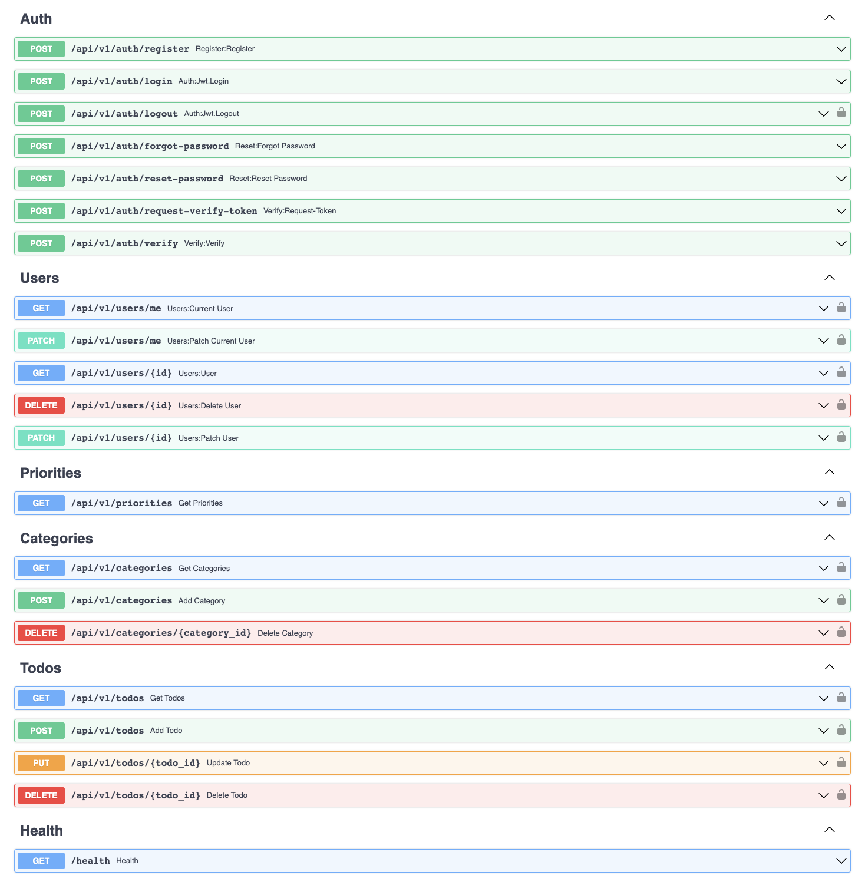

<div align="center">
    <h1>🚀</h1>
  <h1>FastAPI Todos</h1>
  <p>FastAPI 🚀 • PostgreSQL 🐘 • SQLAlchemy 💠 • FastAPIUsers 👥</p>
</div>

## Introduction 🧚

The app provides a fully async backend web server for to-do lists apps.

## API 🌎 
Click [here](./api-docs) for the full API documentation.

[](./api-docs)

## Technologies Used 📱

This project combines the following:

- [`FastAPI`](https://fastapi.tiangolo.com/) for the fast speed web-server and data validation at runtime.
- [`PostgreSQL`](https://www.postgresql.org/) as the database management system (DBMS).
- [`SQLAlchemy`](https://www.sqlalchemy.org/) as the object relational mapper (ORM).
- [`FastAPIUsers`](https://fastapi-users.github.io/fastapi-users/) for registration and authentication system.
- [`Docker`](https://docs.docker.com) for containerizing the application.
- [`Docker Compose`](https://docs.docker.com/compose/) for running the project locally in a containerized environment.

... and some [more stuff](./requirements.txt).

## Running Locally 🏡

### Setting up the project 👷

Clone the repository and navigate to its directory:

    $ git clone https://github.com/eladgunders/fastapi-todos.git
    $ cd fastapi-todos

### Setting up environment variables ⚙️

To properly configure the application, you'll need to define the following environment variables in the ```web-variables.env``` file:

- ```CORS_ORIGINS```: a comma-separated list of allowed origins for Cross-Origin Resource Sharing (CORS).
- ```FRONT_END_BASE_URL```: the base URL of your frontend application.
- ```SMTP_HOST```: the hostname or IP address of the SMTP server that will be used for sending emails.
- ```SMTP_PORT```: the port number of the SMTP server. Usually, this is 587.
- ```SMTP_USER```: the username for authenticating with the SMTP server.
- ```SMTP_PASSWORD```: the password for authenticating with the SMTP server.
- ```EMAILS_FROM_EMAIL```: the email address that will appear as the sender of all system-generated emails.
- ```EMAILS_FROM_NAME```: the name that will appear as the sender of all system-generated emails.

### Running the application with Docker Compose 🐳

To run the application locally, you will need to have [Docker](https://docs.docker.com/get-docker/)
and [Docker Compose](https://docs.docker.com/compose/install/) installed on your machine.

Once you have Docker and Docker Compose installed, you can use the following command to start the application:

    $ docker compose up

If everything is working correctly, you should see output in your terminal indicating
that the application is running.

You can then access the application from http://localhost:8000.

You can also play with the interactive API documentation (Swagger) by visiting http://localhost:8000/docs on your web browser.

## License 📜

This project is under the [MIT license](./LICENSE).
